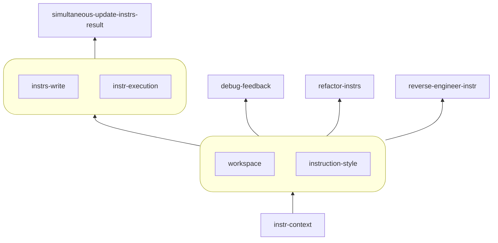

## Многослойная архитектура

```mermaid
flowchart BT
    %% Базовый уровень
    ctx["instr-context"]
    
    style L2 rx:30px,ry:30px
    style L3_core rx:30px,ry:30px

    %% Уровень 2
    subgraph L2 [" "]
        ws["workspace"]
        istyle["instruction-style"]
    end
    ctx --> L2

    %% Уровень 3
    subgraph L3_core [" "]
        write["instrs-write"]
        exec["instr-execution"]
    end
    debug["debug-feedback"]
    refactor["refactor-instrs"]
    rev["reverse-engineer-instr"]
    L2 --> L3_core
    L2 --> debug
    L2 --> refactor
    L2 --> rev
    %% Уровень 4
    simult["simultaneous-update-instrs-result"]
    L3_core --> simult
```