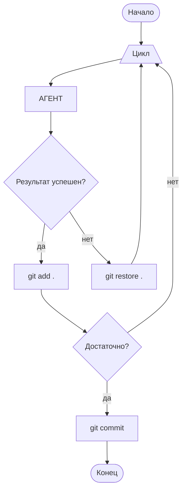

## Использование git только оператором

```mermaid
flowchart TD
    Start([Начало]) --> LoopStart[/Цикл\]
    LoopStart --> H[АГЕНТ]
    H --> C{Результат успешен?}
    C -->|да| D[git add .]
    C -->|нет| E[git restore .]
    D --> Decision{Достаточно?}
    E --> LoopStart
    Decision -->|нет| LoopStart
    Decision -->|да| G[git commit]
    G --> End([Конец])
```